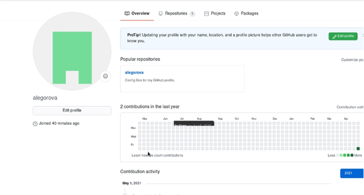
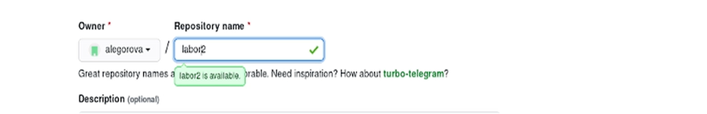
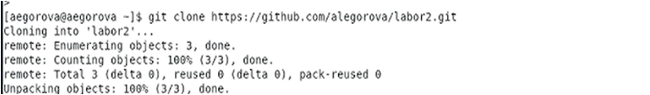
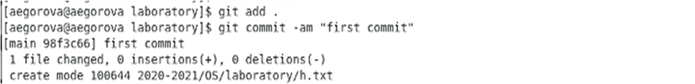
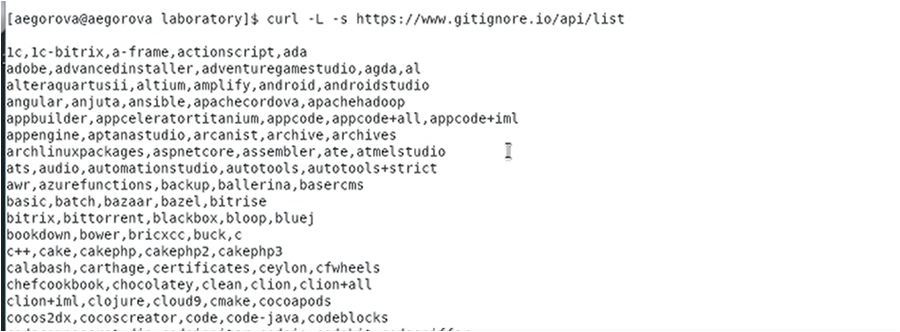
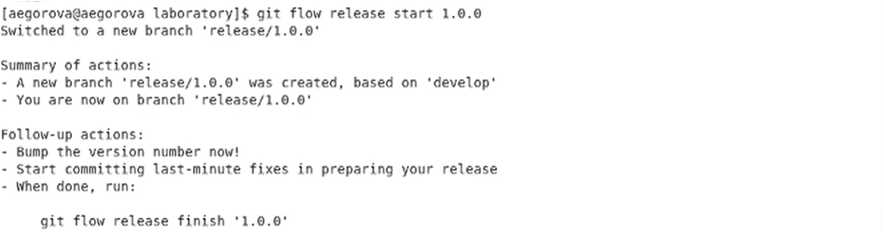
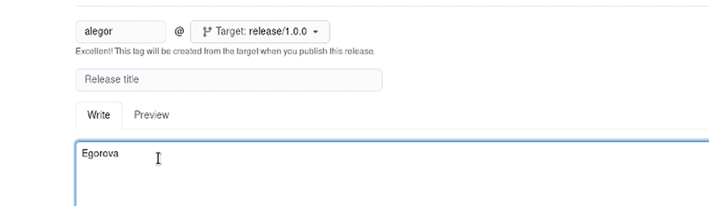
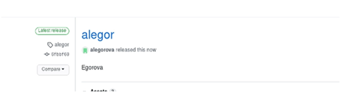

---
## Front matter
lang: ru-RU
title: Лабораторная работа №3
author: |
	Егорова Александра\inst{1}
	
institute: |
	\inst{1}RUDN University, Moscow, Russian Federation
date: 22 мая, 2021, Москва, Россия

## Formatting
toc: false
slide_level: 2
theme: metropolis
header-includes: 
 - \metroset{progressbar=frametitle,sectionpage=progressbar,numbering=fraction}
 - '\makeatletter'
 - '\beamer@ignorenonframefalse'
 - '\makeatother'
aspectratio: 43
section-titles: true
---

## Цель работы

Изучить идеологию и применение средств контроля версий.

## Выполнение лабораторной работы

Создаем учётную запись на github. (рис. -@fig:001)

{ #fig:001 width=70% }

## Выполнение лабораторной работы

Подключение репозитория к github.Заходим в «repositories» и создаем новый репозиторий (имя «labor2»).  Копируем в консоль ссылку на репозиторий. (рис. -@fig:007) (рис. -@fig:008)

{ #fig:007 width=70% }

{ #fig:008 width=70% }

## Выполнение лабораторной работы

Добавляем первый коммит и выкладываем на githup. (рис. -@fig:011)

{ #fig:011 width=70% }

## Выполнение лабораторной работы

Добавим шаблон игнорируемых файлов. Получим список имеющихся шаблонов (на скрине представлены не все шаблоны). (рис. -@fig:014)

{ #fig:014 width=70% }

## Выполнение лабораторной работы

Создадим релиз с версией 1.0.0. Запишем версию и добавим в индекс. (рис. -@fig:019)

{ #fig:019 width=70% }

## Выполнение лабораторной работы

Создаем релиз на github. Заходим в «Releases», нажимаем «Создать новый релиз». Заходим в теги и заполняем все поля.  После создания тега, автоматически сформируется релиз. (рис. -@fig:023) (рис. -@fig:024)

{ #fig:023 width=70% }

{ #fig:024 width=70% }

## Выводы

В ходе выполнения лабораторной работы я изучила идеологию и применение средств контроля версий.

