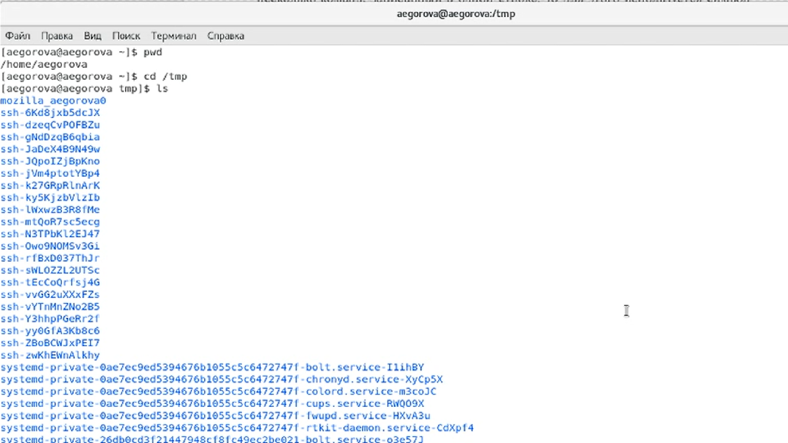

---
## Front matter
lang: ru-RU
title: Лабораторная работа №5
author: |
	Егорова Александра\inst{1}
	
institute: |
	\inst{1}RUDN University, Moscow, Russian Federation
date: 22 мая, 2021, Москва, Россия

## Formatting
toc: false
slide_level: 2
theme: metropolis
header-includes: 
 - \metroset{progressbar=frametitle,sectionpage=progressbar,numbering=fraction}
 - '\makeatletter'
 - '\beamer@ignorenonframefalse'
 - '\makeatother'
aspectratio: 43
section-titles: true
---

## Цель работы

Приобретение практических навыков взаимодействия пользователя с системой посредством командной строки.

## Выполнение лабораторной работы

1) Определяем полное имя домашнего каталога. Переходим в каталог. Выводим на экран содержимое каталога. (рис. -@fig:001)

{ #fig:001 width=70% }

## Выполнение лабораторной работы

## Выполнение лабораторной работы

## Выполнение лабораторной работы

## Выполнение лабораторной работы

## Выполнение лабораторной работы

## Выводы

