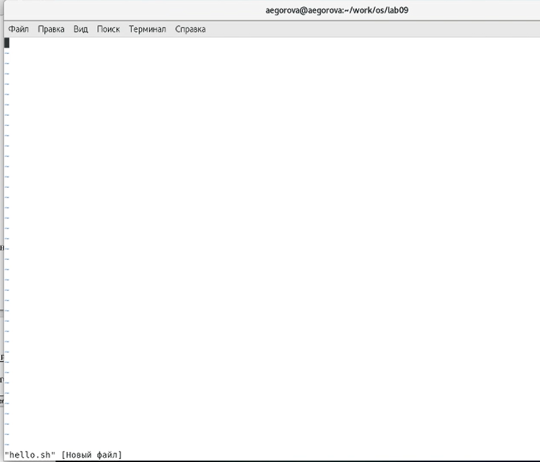

---
## Front matter
lang: ru-RU
title: Лабораторная работа №9
author: |
	Егорова Александра\inst{1}
	
institute: |
	\inst{1}RUDN University, Moscow, Russian Federation
date: 22 мая, 2021, Москва, Россия

## Formatting
toc: false
slide_level: 2
theme: metropolis
header-includes: 
 - \metroset{progressbar=frametitle,sectionpage=progressbar,numbering=fraction}
 - '\makeatletter'
 - '\beamer@ignorenonframefalse'
 - '\makeatother'
aspectratio: 43
section-titles: true
---

## Цель работы

Познакомиться с операционной системой Linux. Получить практические навыки работы с редактором vi, установленным по умолчанию практически во всех дистрибутивах.

## Выполнение лабораторной работы
Задание 1:
1) Командой «cd work/os/lab06» переходим в созданный каталог. Вызываем vi и создаем файл hello.sh с помощью команды «vi hello.sh».(рис. -@fig:002)

{ #fig:002 width=70% }

## Выполнение лабораторной работы

2) Вводим текст, указанный в лабораторной работе. (рис. -@fig:003)

{ #fig:003 width=70% }

## Выполнение лабораторной работы

3) Переходим в режим последней строки. Сохраняем текст и завершаем работу. Делаем файл исполняемым. (рис. -@fig:005) (рис. -@fig:006)

{ #fig:005 width=70% }

{ #fig:006 width=70% }

## Выполнение лабораторной работы

Задание 2:
1) Вызовем vi для редактирования файла с помощью команды «vi ~/work/os/lab06/hello.sh». (рис. -@fig:007) (рис. -@fig:008)

{ #fig:007 width=70% }

{ #fig:008 width=70% }

## Выполнение лабораторной работы

2) Переходим к редактированию текста. Редактируем, удаляем и вставляем слова и тексты. Выполняем отмену команд. (рис. -@fig:014)

{ #fig:014 width=70% }

## Выполнение лабораторной работы

3) Записывем произведенные изменения и выходим из vi. (рис. -@fig:017)

{ #fig:017 width=70% }

## Выводы

В ходе выполнения данной лабораторной работы я познакомилась с операционной системой Linux и получила практические навыки работы с редактором vi.

