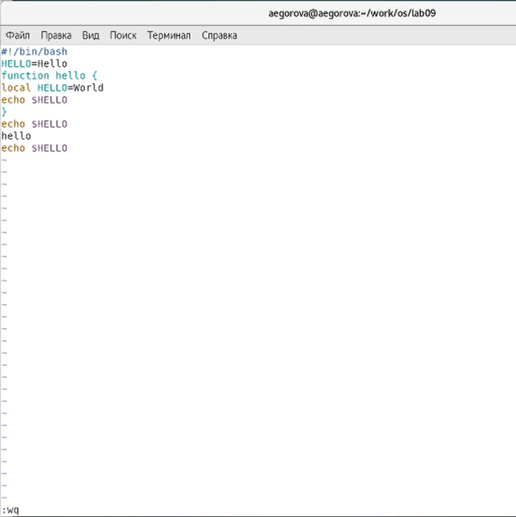

---
# Front matter
lang: ru-RU
title: "Лабораторная работа №9"
subtitle: "Дисциплина: Операционные системы"
author: "Егорова Александра"

# Formatting
toc-title: "Содержание"
toc: true # Table of contents
toc_depth: 2
fontsize: 12pt
linestretch: 1.5
papersize: a4paper
documentclass: scrreprt
polyglossia-lang: russian
polyglossia-otherlangs: english
mainfont: PT Serif
romanfont: PT Serif
sansfont: PT Sans
monofont: PT Mono
mainfontoptions: Ligatures=TeX
romanfontoptions: Ligatures=TeX
sansfontoptions: Ligatures=TeX,Scale=MatchLowercase
monofontoptions: Scale=MatchLowercase
indent: true
pdf-engine: lualatex
header-includes:
  - \linepenalty=10 # the penalty added to the badness of each line within a paragraph (no associated penalty node) Increasing the value makes tex try to have fewer lines in the paragraph.
  - \interlinepenalty=0 # value of the penalty (node) added after each line of a paragraph.
  - \hyphenpenalty=50 # the penalty for line breaking at an automatically inserted hyphen
  - \exhyphenpenalty=50 # the penalty for line breaking at an explicit hyphen
  - \binoppenalty=700 # the penalty for breaking a line at a binary operator
  - \relpenalty=500 # the penalty for breaking a line at a relation
  - \clubpenalty=150 # extra penalty for breaking after first line of a paragraph
  - \widowpenalty=150 # extra penalty for breaking before last line of a paragraph
  - \displaywidowpenalty=50 # extra penalty for breaking before last line before a display math
  - \brokenpenalty=100 # extra penalty for page breaking after a hyphenated line
  - \predisplaypenalty=10000 # penalty for breaking before a display
  - \postdisplaypenalty=0 # penalty for breaking after a display
  - \floatingpenalty = 20000 # penalty for splitting an insertion (can only be split footnote in standard LaTeX)
  - \raggedbottom # or \flushbottom
  - \usepackage{float} # keep figures where there are in the text
  - \floatplacement{figure}{H} # keep figures where there are in the text
---

# Цель работы

Познакомиться с операционной системой Linux. Получить практические навыки работы с редактором vi, установленным по умолчанию практически во всех дистрибутивах.

# Задание

Задание 1 (Создание нового файла с использованием vi): 
1. Создайте каталог с именем ~/work/os/lab06 .
2. Перейдите во вновь созданный каталог.
3. Вызовите vi и создайте файл hello.sh vi hello.sh
4. Нажмите клавишу i и вводите следующий текст.
5. Нажмите клавишу текста. Esc для перехода в командный режим после завершения ввода
6. Нажмите : для перехода в режим последней строки и внизу вашего экрана появится приглашение в виде двоеточия.
7. Нажмите w (записать) и q (выйти), а затем нажмите клавишу Enter для сохранения вашего текста и завершения работы.
8. Сделайте файл исполняемым chmod +x hello.sh

Задание 2 (Редактирование существующего файла):
1. Вызовите vi на редактирование файла vi ~/work/os/lab06/hello.sh
2. Установите курсор в конец слова HELL второй строки.
3. Перейдите в режим вставки и замените на HELLO . Нажмите Esc для возврата в командный режим.
4. Установите курсор на четвертую строку и сотрите слово LOCAL .
5. Перейдите в режим вставки и наберите следующий текст: local , нажмите Esc для возврата в командный режим.
6. Установите курсор на последней строке файла. Вставьте после неё строку, содержащую следующий текст: echo $HELLO .
7. Нажмите Esc для перехода в командный режим.
8. Удалите последнюю строку.
9. Введите команду отмены изменений u для отмены последней команды.
10. Введите символ : для перехода в режим последней строки. Запишите произведённые изменения и выйдите из vi.

# Выполнение лабораторной работы

Задание 1:
1) Создаем в домашней папке каталог work/os/lab06, используя команду «mkdir -p work/os/lab06», где опция -p позволяет создать все каталоги, которые указаны внутри пути (рис. -@fig:001)

2) Командой «cd work/os/lab06» переходим в созданный каталог.(рис. -@fig:001)

{ #fig:001 width=70% }

3) Вызываем vi и создаем файл hello.sh с помощью команды «vi hello.sh».(рис. -@fig:002)

{ #fig:002 width=70% }

4) Нажимаем клавишу «i» и вводим текст, указанный в лабораторной работе. (рис. -@fig:003)

{ #fig:003 width=70% }

5) Нажимаем клавишу «esc», чтобы перейти в командный режим после завершения ввода текста. (рис. -@fig:004)

{ #fig:004 width=70% }

6) Нажимаем «:» для перехода в режим последней строки и внизу экрана видим, что появилось приглашение в виде двоеточия. 

7) Нажимаем «w» (записать) и «q» (выйти), далее нажимаем клавишу «enter» для сохранения текста и завершения работы. (рис. -@fig:005)

{ #fig:005 width=70% }

8) Чтобы сделать файл исполняемым, используем команду «chmod +x hello.sh». (рис. -@fig:006)

{ #fig:006 width=70% }

Задание 2:

2) Далее с помощью стрелок установила курсор в конец слова HELL второй строки. (рис. -@fig:009)

{ #fig:009 width=70% }

3) Перейдем в режим вставки, нажав на клавишу «i», и заменим HELL наHELLO, дописав O. Нажмем «esc» для возврата в командный режим. (рис. -@fig:010) 

{ #fig:010 width=70% }

4) С помощью стрелок установим курсор на четвертую строку и сотрем слово LOCAL с помощью комбинации клавиш «d» (delete) и «w» (word). (рис. -@fig:011)

{ #fig:011 width=70% }

5) Перейдем в режим вставки, нажав клавишу «i», и наберем следующий текст:local. Нажмем «esc» для возврата в командный режим. (рис. -@fig:012)

{ #fig:012 width=70% }

6) Установим курсор на последней строке файла, используя стрелки. Вставим после неё строку, содержащую следующий текст: echo $HELLO. (рис. -@fig:013) (рис. -@fig:014)

{ #fig:013 width=70% }

{ #fig:014 width=70% }

7) Далее нажимаем «esc», чтобы перейти в командный режим.

8) Удаляем последнюю строку, используя комбинацию клавиш «d» и «d». (рис. -@fig:015)

{ #fig:015 width=70% }

9) Введем команду отмены изменений «u» для отмены последней команды. (рис. -@fig:016)

{ #fig:016 width=70% }

10) Введем символ «:» для перехода в режим последней строки. Запишем произведённые изменения, нажав «w» и «q» и выйдем из vi. (рис. -@fig:017)

{ #fig:017 width=70% }

# Выводы

В ходе выполнения данной лабораторной работы я познакомилась с операционной системой Linux и получила практические навыки работы с редактором vi.

# Контрольные вопросы

1) Редактор vi имеет три режима работы: 1. командный режим − предназначен для ввода команд редактирования и навигации по редактируемому файлу; 2. режим вставки − предназначен для ввода содержания редактируемого файла; 3. режим последней (или командной) строки − используется для записи изменений в файл и выхода из редактора.

2) Чтобы выйти из редактора, не сохраняя произведённые изменения, нужно в режиме командной строки нажать клавиши «:» «q» «!»

3) Команды позиционирования: 1) «0» (ноль) − переход в начало строки; 2)«$» − переход в конец строки; 3) «G» − переход в конец файла;4) n«G» − переход на строку с номером n.

4) При использовании прописных W и B под разделителями понимаются только пробел, табуляция и возврат каретки. При использовании строчных w и b под разделителями понимаются также любые знаки пунктуации.

5) Чтобы из любого места редактируемого файла перейти в начало (конец) файла, нужно в режиме командной строки нажать клавиши «1» «G» («G»).

6) Команды редактирования:
Вставка текста
 1) «а» − вставить текст после курсора;
 2) «А» − вставить текст в конец строки;
 3) «i» − вставить текст перед курсором;
 4) n «i» − вставить текст n раз;
 5) «I» − вставить текст в начало строки.
Вставка строки
 1) «о» − вставить строку под курсором;
 2) «О» − вставить строку над курсором.
Удаление текста
 1) «x» − удалить один символ в буфер;
 2) «d» «w» − удалить одно слово в буфер;
 3)«d» «$» − удалить в буфер текст от курсора до конца строки;
 4)«d» «0» − удалить в буфер текст от начала строки до позиции курсора;
 5) «d» «d» − удалить в буфер одну строку;
 6) n «d» «d» − удалить в буфер n строк.
Отмена и повтор произведённых изменений
 1) «u» − отменить последнее изменение;
 2) «.» − повторить последнее изменение.
Копирование текста в буфер
 1) «Y» − скопировать строку в буфер;
 2) n «Y» − скопировать n строк в буфер;
 3) «y» «w» − скопировать слово в буфер.
Вставка текста из буфера
 1) «p» − вставить текст из буфера после курсора;
 2) «P» − вставить текст из буфера перед курсором.
Замена текста
 1) «c» «w» − заменить слово;
 2) n «c» «w» − заменить n слов;
 3)«c» «$» − заменить текст от курсора до конца строки;
 4)«r» − заменить слово;
 5)«R» − заменить текст.
Поиск текста
 1) «/» текст − произвести поиск вперёд по тексту указанной строки символов текст;
 2)«?» текст − произвести поиск назад по тексту указанной строки символов текст.
Копирование и перемещение текста
 1) «:» n,m «d» – удалить строки с n по m;
 2) «:» i,j «m» k – переместить строки с i по j, начиная со строки k;
 3) «:» i,j «t» k – копировать строки с i по j в строку k;
 4) «:» i,j «w» имя-файла – записать строки с i по j в файл с именем имя-файла.

7) Чтобы заполнить строку символами $, необходимо для начала перейти на эту строку, нажав клавиши n «G», где n – номер строки, далее нажать «0» для перехода в начало строки. Теперь необходимо нажать «c» «$», чтобы заменить текст от курсора до конца строки, и ввести символы $.

8) Чтобы отменить по одному предыдущему действию последовательно,необходимо нажать «u». Чтобы отменить все изменения, произведённые со времени последней записи, нужно нажать «:» «e» «!».

9) Команды редактирования в режиме командной строки
Копирование и перемещение текста
 1) «:» n,m «d» − удалить строки с n по m;
 2) «:» i,j «m» k − переместить строки с i по j, начиная со строки k;
 3) «:» i,j «t» k − копировать строки с i по j в строку k;
 4) «:» i,j «w» имя-файла − записать строки с i по j в файл с именем имя-файла.
Запись в файл и выход из редактора
 1) «:» «w» − записать изменённый текст в файл, не выходя из vi;
 2) «:» «w» имя-файла − записать изменённый текст в новый файл с именем имя-файла;
 3) «:» «w» «!» имя-файла − записать изменённый текст в файл с именем имя-файла;
 4) «:» «w» «q» − записать изменения в файл и выйти из vi;
 5) «:» «q» − выйти из редактора vi;
 6) «:» «q» «!» − выйти из редактора без записи;
 7) «:» «e» «!» − вернуться в командный режим, отменив все изменения, произведённые со времени последней записи.
Опции
Опции редактора vi позволяют настроить рабочую среду. Для задания опций используется команда set (в режиме последней строки):
 1) «:» set all − вывести полный список опций;
 2) «:» set nu − вывести номера строк;
 3) «:» set list − вывести невидимые символы;
 4)«:» set ic − не учитывать при поиске, является ли символ прописным или строчным.
Если вы хотите отказаться от использования опции, то в команде setперед именем опции надо поставить no.

10) Чтобы определить, не перемещая курсора, позицию, в которой заканчивается строка, нужно в командном режиме находясь на нужной строке нажать «$» и посмотреть на число после запятой в правом нижнем углу экрана.

11) Опции редактора vi позволяют настроить рабочую среду. Для задания опций используется команда set (в режиме командной строки). Если вы хотите отказаться от использования опции, то в команде set перед именем опции надо поставить no. Чтобы просмотреть опции редактора vi, необходимо нажать «:» set all. Нажав «:» help “название_опции”, можно узнать назначение конкретной опции.

12) В режиме командной строки внизу редактора присутствует «:», в режиме ввода – «-- ВСТАВКА --», в командном режиме внизу ничего нет.

13) Граф взаимосвязи режимов работы редактора vi

