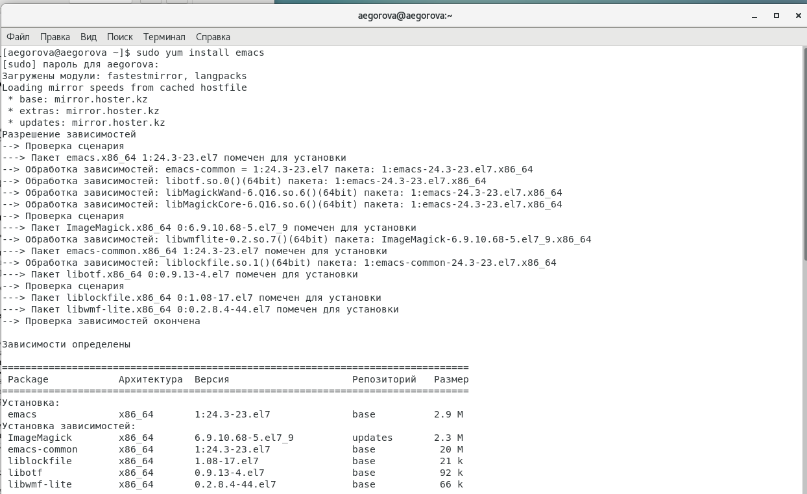
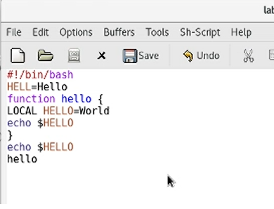
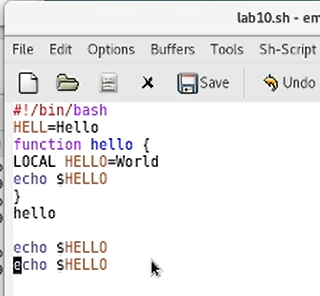
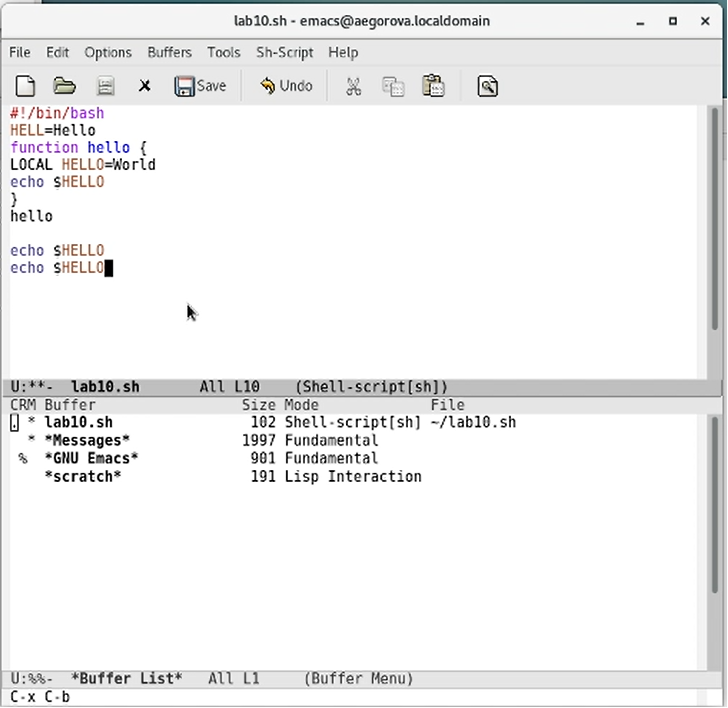
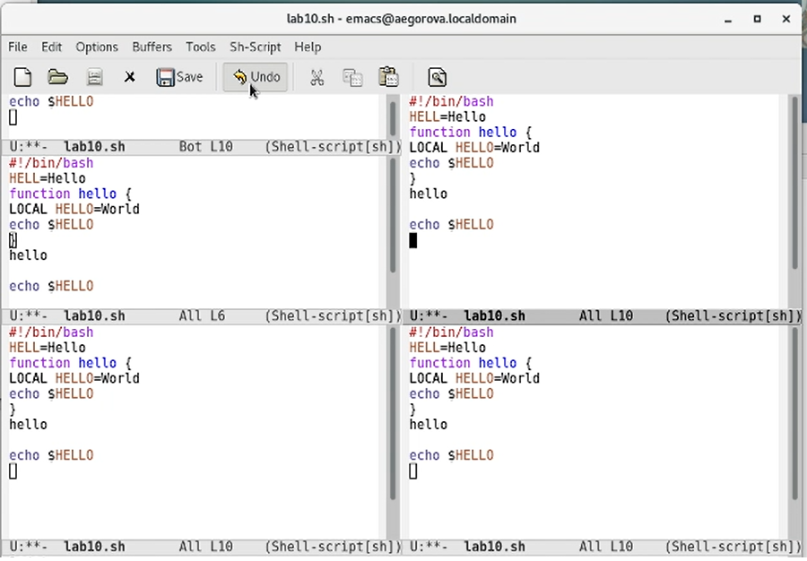
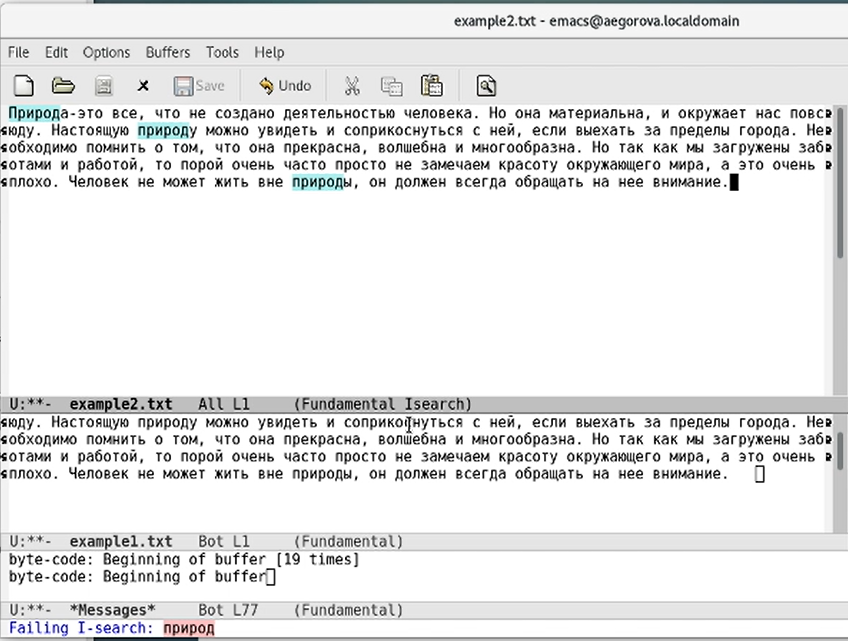
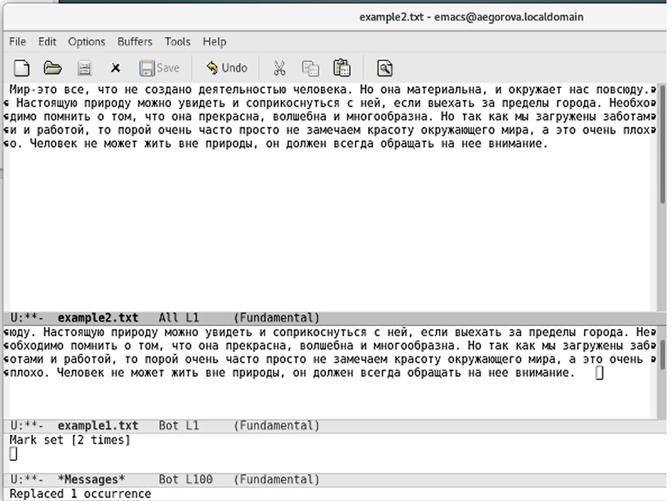
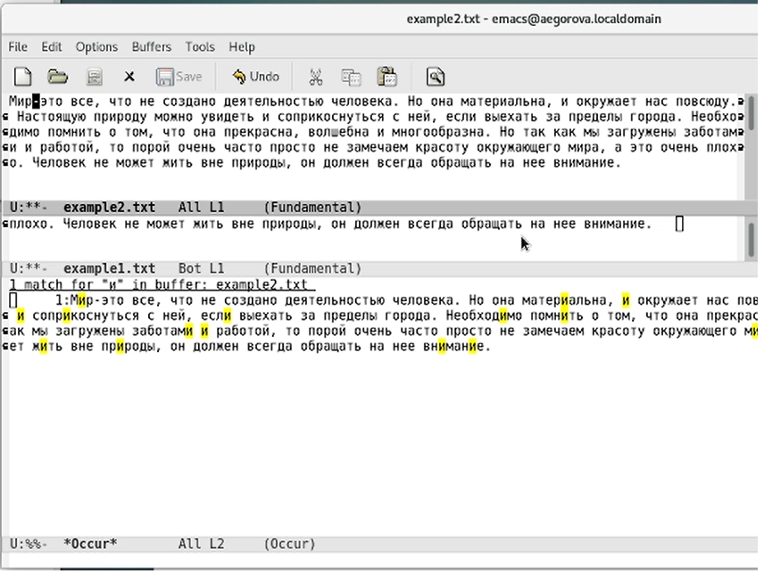

---
## Front matter
lang: ru-RU
title: Лабораторная работа №10
author: |
	Егорова Александра\inst{1}

institute: |
	\inst{1}RUDN University, Moscow, Russian Federation
date: 22 мая, 2021, Москва, Россия

## Formatting
toc: false
slide_level: 2
theme: metropolis
header-includes: 
 - \metroset{progressbar=frametitle,sectionpage=progressbar,numbering=fraction}
 - '\makeatletter'
 - '\beamer@ignorenonframefalse'
 - '\makeatother'
aspectratio: 43
section-titles: true
---

## Цель работы

Познакомиться с операционной системой Linux. Получить практические навыки работы с редактором Emacs.

## Выполнение лабораторной работы

1) Для работы с Emacs необходимо установить данный редактор,используя команду "sudo yum install emacs". (рис. -@fig:001)

{ #fig:001 width=70% }

## Выполнение лабораторной работы

2) Откроем редактор Emacs. Создадим файл lab10.sh и наберем необходимый текст. (рис. -@fig:005)

{ #fig:005 width=70% }

## Выполнение лабораторной работы

3) Проделаем с текстом стандартные процедуры редактирования (вставка, копирование, выделение). Учимся использовать команды по перемещению курсора. (рис. -@fig:012)

{ #fig:012 width=70% }

## Выполнение лабораторной работы

4) Учимся управлять буферами. (рис. -@fig:016)

{ #fig:016 width=70% }

## Выполнение лабораторной работы

5) Учимся и практикуем управление окнами. (рис. -@fig:023)

{ #fig:023 width=70% }

## Выполнение лабораторной работы

6) Изучаем режим поиска. (рис. -@fig:026)

{ #fig:026 width=70% }

## Выполнение лабораторной работы

7) Переходим в режим поиска и замены, вводим текст, который следует найти и заменить. (рис. -@fig:033)

{ #fig:033 width=70% }

## Выполнение лабораторной работы

8) Пробуем другой режим поиска. (рис. -@fig:035)

{ #fig:035 width=70% }

## Выводы

В ходе выполнения данной лабораторной работы я познакомилась с операционной системой Linux и получила практические навыки работы с редактором Emacs.

