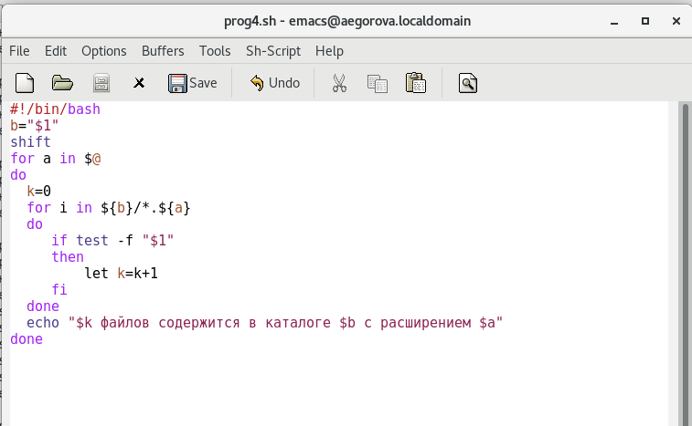

---
## Front matter
lang: ru-RU
title: Лабораторная работа №11
author: |
	Егорова Александра\inst{1}

institute: |
	\inst{1}RUDN University, Moscow, Russian Federation
date: 26 мая, 2021, Москва, Россия

## Formatting
toc: false
slide_level: 2
theme: metropolis
header-includes: 
 - \metroset{progressbar=frametitle,sectionpage=progressbar,numbering=fraction}
 - '\makeatletter'
 - '\beamer@ignorenonframefalse'
 - '\makeatother'
aspectratio: 43
section-titles: true
---

## Цель работы

Изучить основы программирования в оболочке ОС UNIX/Linux. Научиться писать небольшие командные файлы.

## Выполнение лабораторной работы

1) Cоздаем файл, в котором напишем первый скрипт и откроем его в редакторе emacs. После напишем скрипт, который при запуске будет делать резервную копию самого себя в другую директорию backup в домашнем каталоге. При этом файл должен архивироваться одним из архиваторов на выбор. (рис. -@fig:006)

{ #fig:006 width=70% }

## Выполнение лабораторной работы

2) Создаем второй файл, в котором будет написан второй скрипт. Написала пример командного файла, обрабатывающего любое произвольное число аргументов командной строки, в том числе превышающее десять. Например, скрипт может последовательно распечатывать значения всех переданных аргументов. (рис. -@fig:009)

{ #fig:009 width=70% }

## Выполнение лабораторной работы

 Проверила работу написанного скрипта, предварительно добавив для него право на выполнение. Вводила аргументы, количество которых меньше 10 и больше 10.(рис. -@fig:010)

{ #fig:010 width=70% }

## Выполнение лабораторной работы

3) Создала файл, в котором буду писать третий скрипт. Написала командный файл − аналог команды ls (без использования самой этой команды и команды dir). Он должен выдавать информациюо нужном каталоге и выводить информацию о возможностях доступа к файлам этого каталога. (рис. -@fig:012)

{ #fig:012 width=70% }

## Выполнение лабораторной работы

Далее проверила работу скрипта, предварительно добавив для него право на выполнение. Скрипт работает корректно. (рис. -@fig:013)

{ #fig:013 width=70% }

## Выполнение лабораторной работы

4) Для четвертого скрипта также создала файл и открыла его в редакторе. Написала командный файл, который получает в качестве аргумента командной строки формат файла (.txt, .doc, .jpg, .pdf и т.д.) и вычисляет количество таких файлов в указанной директории. Путь к директории также передаётся в виде аргумента командной строки. (рис. -@fig:015)

{ #fig:015 width=70% }

## Выполнение лабораторной работы

5) Проверила работу написанного скрипта, предварительно добавив для него право на выполнение, а также создав дополнительные файлы с разными расширениями. Скрипт работает корректно. (рис. -@fig:016)( рис. -@fig:017)

{ #fig:016 width=70% }

{ #fig:017 width=70% }

## Выводы

В ходе выполнения данной лабораторной работы я изучила основы программирования в оболочке ОС UNIX/Linux и научилась писать небольшие командные файлы.

