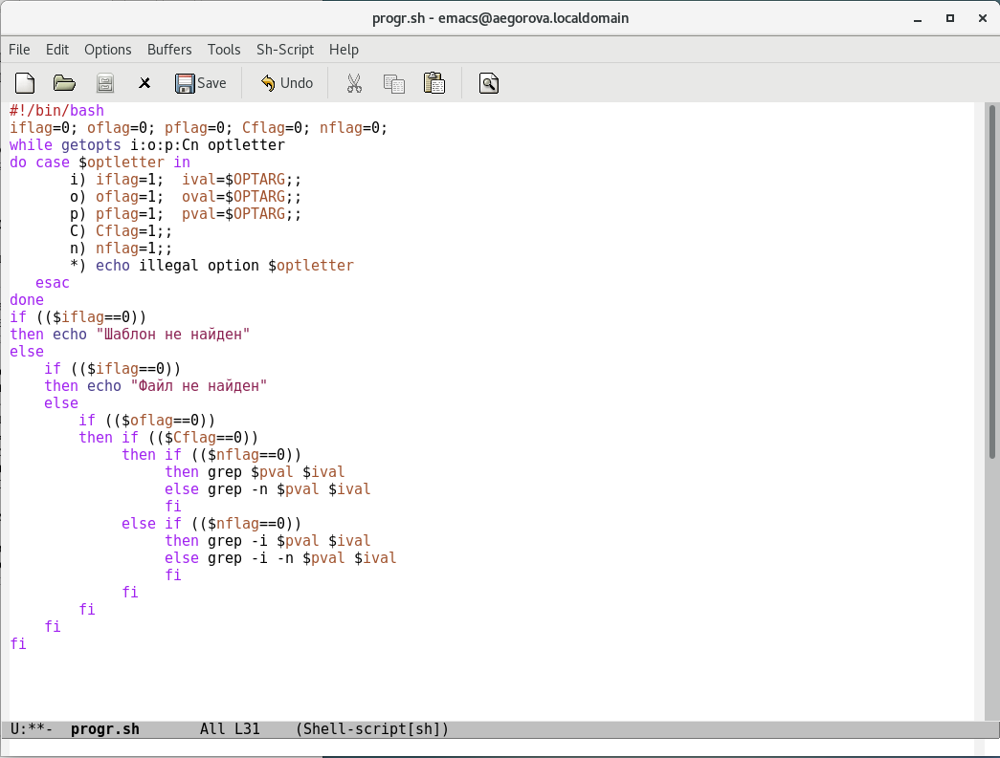
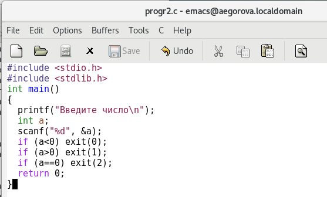
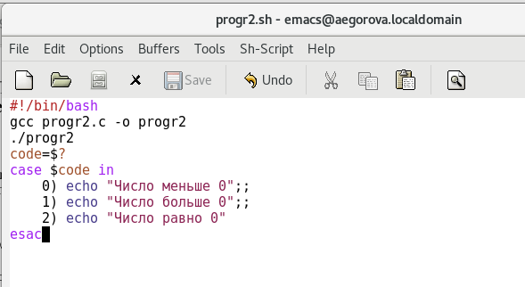
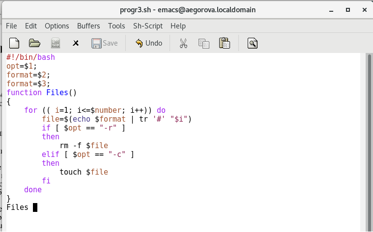
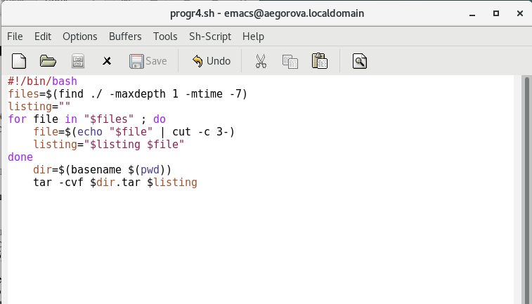

---
## Front matter
lang: ru-RU
title: Лабораторная работа №12
author: |
	Егорова Александра\inst{1}

institute: |
	\inst{1}RUDN University, Moscow, Russian Federation
date: 27 мая, 2021, Москва, Россия

## Formatting
toc: false
slide_level: 2
theme: metropolis
header-includes: 
 - \metroset{progressbar=frametitle,sectionpage=progressbar,numbering=fraction}
 - '\makeatletter'
 - '\beamer@ignorenonframefalse'
 - '\makeatother'
aspectratio: 43
section-titles: true
---

## Цель работы

Изучить основы программирования в оболочке ОС UNIX. Научится писать более сложные командные файлы с использованием логических управляющих конструкций и циклов.

## Выполнение лабораторной работы

1) Используя команды getopts grep, написала командный файл, который анализирует командную строку с ключами (рис. -@fig:001)

{ #fig:001 width=70% }

## Выполнение лабораторной работы

2) Написала на языке Си программу, которая вводит число и определяет, является ли оно больше нуля, меньше нуля или равно нулю. (рис. -@fig:003)

{ #fig:003 width=70% }

## Выполнение лабораторной работы

Для данной задачи я создала 2 файла: progr2.c и progr2.sh и написала соответствующие скрипты. (рис. -@fig:004)

{ #fig:004 width=70% }

## Выполнение лабораторной работы

3) Написала командный файл, создающий указанное число файлов, пронумерованных последовательно от 1 до N. Число файлов, которые необходимо создать, передаётся в аргументы командной строки. Этот же командный файл должен уметь удалять все созданные им файлы (если они существуют). (рис. -@fig:006)

{ #fig:006 width=70% }

## Выполнение лабораторной работы

4) Написала командный файл, который с помощью команды tar запаковывает в архив все файлы в указанной директории. Модифицировала его так, чтобы запаковывались только те файлы, которые были изменены менее недели тому назад. (рис. -@fig:009)

{ #fig:009 width=70% }

## Выводы

В ходе выполнения данной лабораторной работы я изучила основы программирования в оболочке ОС UNIX и научилась писать более сложные командные файлы с использованием логических управляющих конструкций и циклов.

