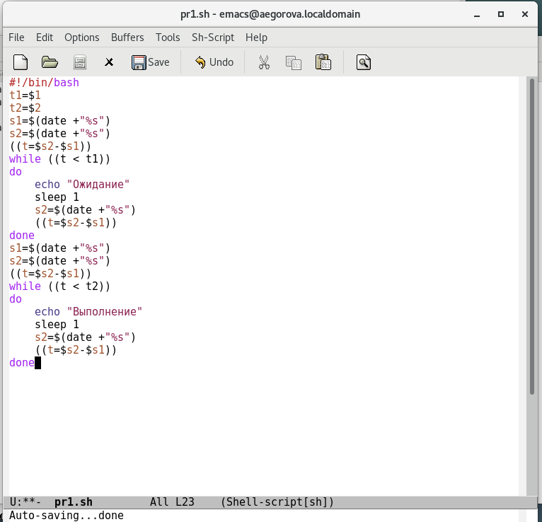
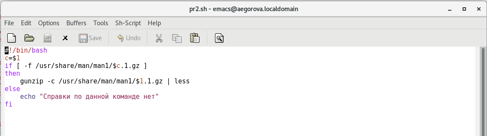
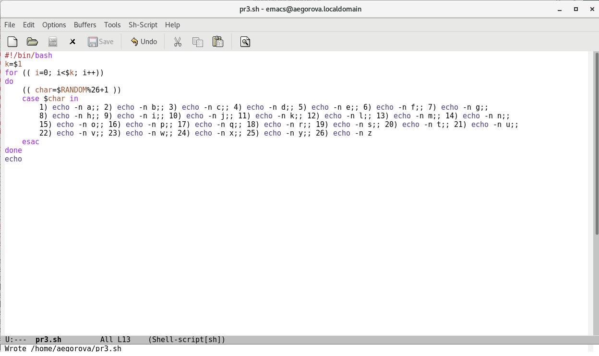

---
## Front matter
lang: ru-RU
title: Лабораторная работа №13
author: |
	Егорова Александра\inst{1}

institute: |
	\inst{1}RUDN University, Moscow, Russian Federation
date: 3 июня, 2021, Москва, Россия

## Formatting
toc: false
slide_level: 2
theme: metropolis
header-includes: 
 - \metroset{progressbar=frametitle,sectionpage=progressbar,numbering=fraction}
 - '\makeatletter'
 - '\beamer@ignorenonframefalse'
 - '\makeatother'
aspectratio: 43
section-titles: true
---

## Цель работы

Изучить основы программирования в оболочке ОС UNIX. Научиться писать более сложные командные файлы с использованием логических управляющих конструкций и циклов.

## Выполнение лабораторной работы

1) Cоздала файл и написала соответствующий скрипт. Написала командный файл, реализующий упрощённый механизм семафоров. (рис. -@fig:002)

{ #fig:002 width=70% }

## Выполнение лабораторной работы

Создала файл и написала соответствующий скрипт. Командный файл должен получать в виде аргумента командной строки название команды и в виде результата выдавать справку об этой команде или сообщение об отсутствии справки, если соответствующего файла нет в каталоге. Скрипт работает корректно. (рис. -@fig:008)

{ #fig:008 width=70% }

## Выполнение лабораторной работы

Используя встроенную переменную $RANDOM, написала командный файл, генерирующий случайную последовательность букв латинского алфавита. Для данной задачи я создала файл: pr3.sh и написала соответствующий скрипт. (рис. -@fig:012)

{ #fig:012 width=70% }

## Выводы

В ходе выполнения данной лабораторной работы я изучила основы программирования в оболочке ОС UNIX, а также научилась писать более сложные командные файлы с использованием логических управляющих конструкций и циклов.

