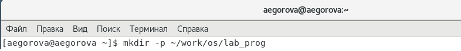
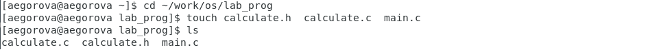
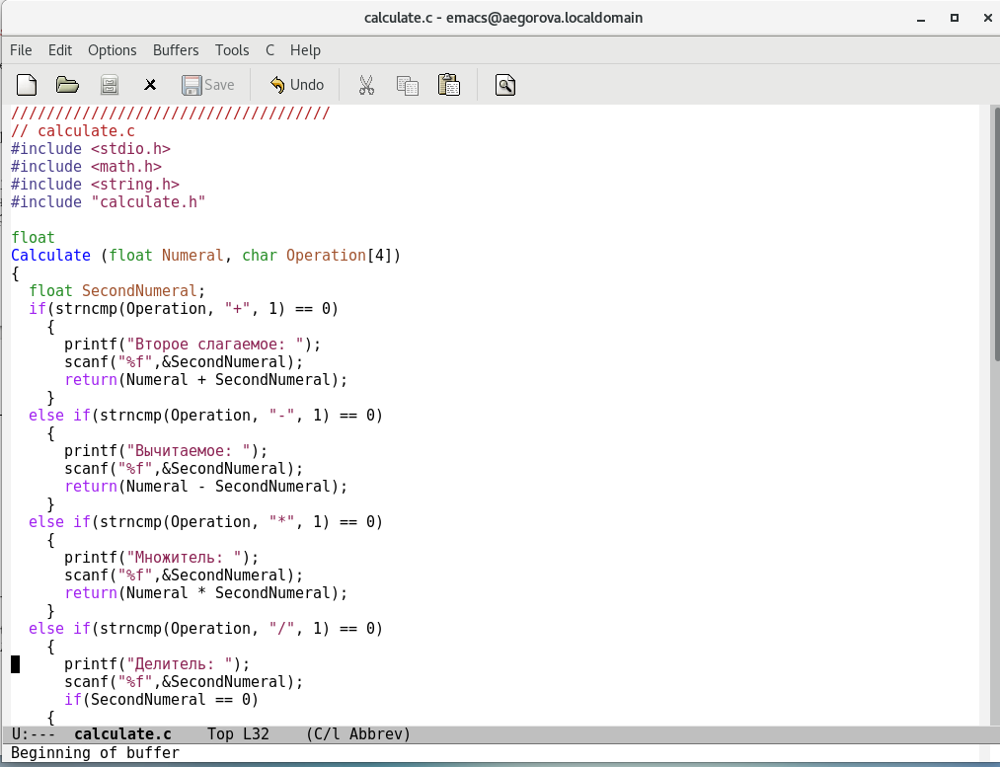
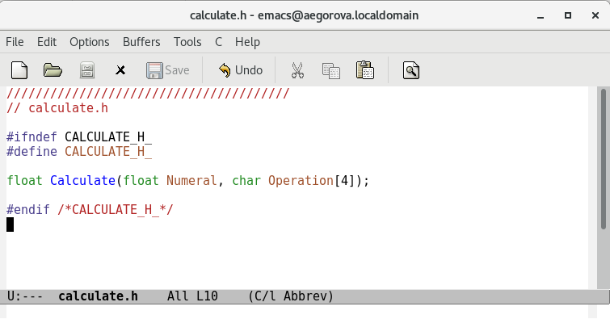
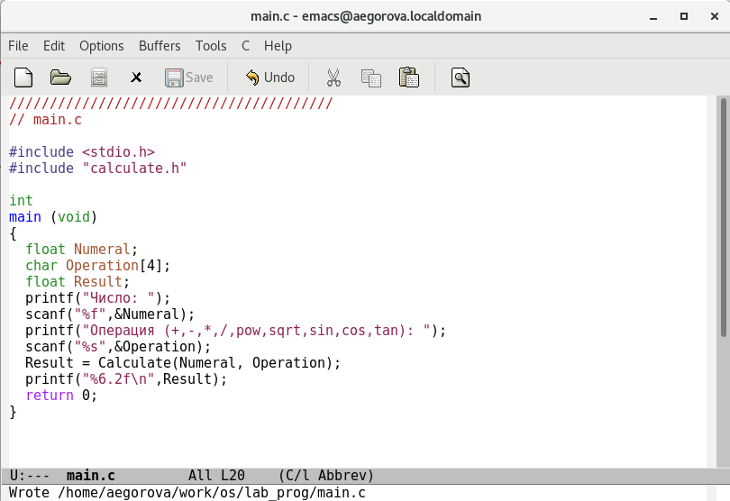
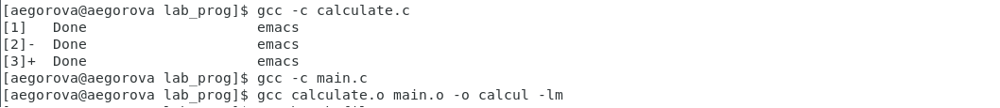
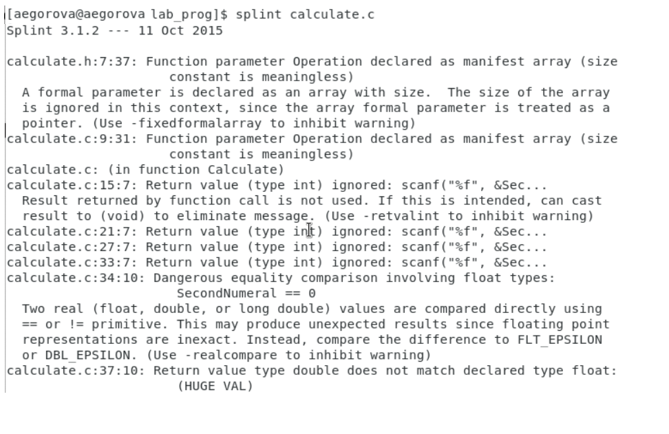

---
## Front matter
lang: ru-RU
title: Лабораторная работа №14
author: |
	Егорова Александра\inst{1}

institute: |
	\inst{1}RUDN University, Moscow, Russian Federation
date: 3 июня, 2021, Москва, Россия

## Formatting
toc: false
slide_level: 2
theme: metropolis
header-includes: 
 - \metroset{progressbar=frametitle,sectionpage=progressbar,numbering=fraction}
 - '\makeatletter'
 - '\beamer@ignorenonframefalse'
 - '\makeatother'
aspectratio: 43
section-titles: true
---

## Цель работы

Приобрести простейшие навыки разработки, анализа, тестирования и отладки приложений в ОС типа UNIX/Linux на примере создания на языке программирования С калькулятора с простейшими функциями.

## Выполнение лабораторной работы

1) В домашнем каталоге создаю подкаталог ~/work/os/lab_prog. Создала в каталоге файлы. Это будет примитивнейший калькулятор, способный складывать, вычитать, умножать и делить, возводить число в степень, брать квадратный корень, вычислять sin, cos, tan. (рис. -@fig:001) (рис. -@fig:002)

{ #fig:001 width=70% }

{ #fig:002 width=70% }

## Выполнение лабораторной работы

Реализация функций калькулятора в файле calculate.с. Интерфейсный файл calculate.h , описывающий формат вызова функции-калькулятора. Основной файл main.c , реализующий интерфейс пользователя к калькулятору. (рис. -@fig:003)

{ #fig:003 width=70% }

## Выполнение лабораторной работы

calculate.h (рис. -@fig:005) 

{ #fig:005 width=70% } 

## Выполнение лабораторной работы

main.c. (рис. -@fig:006)

{ #fig:006 width=70% }

## Выполнение лабораторной работы

3) Выполнила компиляцию программы посредством gcc : gcc -c calculate.c; gcc -c main.c; gcc calculate.o main.o -o calcul -lm. (рис. -@fig:007)

{ #fig:007 width=70% }

## Выполнение лабораторной работы

С помощью утилиты splint попробовала проанализировать коды файлов calculate.c и main.c. (рис. -@fig:021)

{ #fig:021 width=70% }

## Выводы

В ходе выполнения данной лабораторной работы я приобрела простейшие навыки разработки, анализа, тестирования и отладки приложений в ОС типа UNIX/Linux на примере создания на языке программирования С калькулятора с простейшими функциями.

