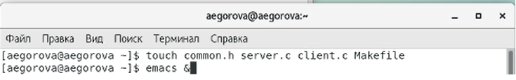
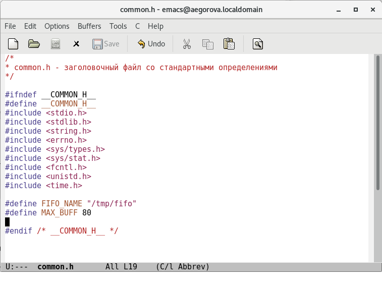
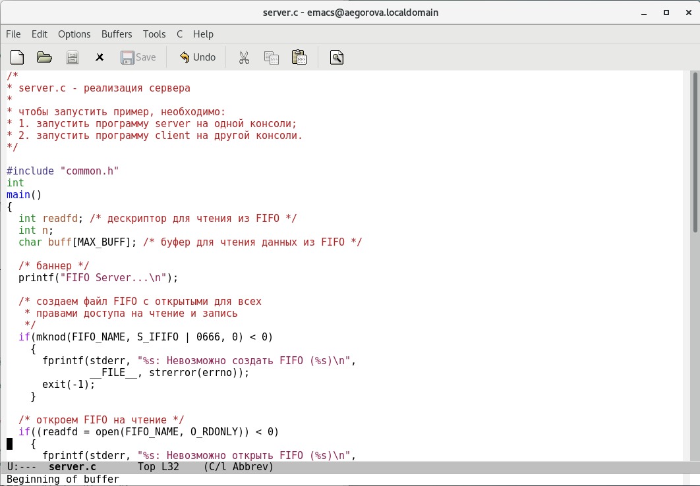
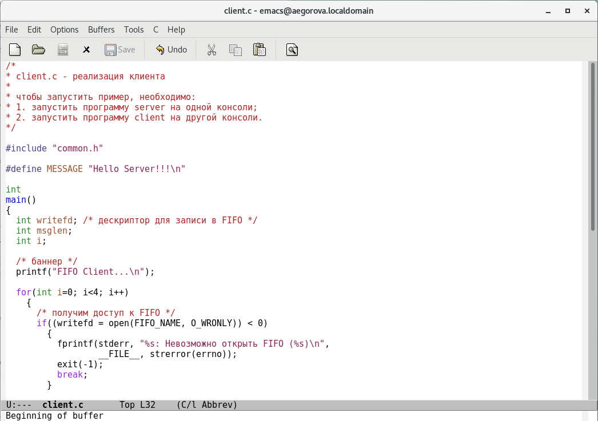
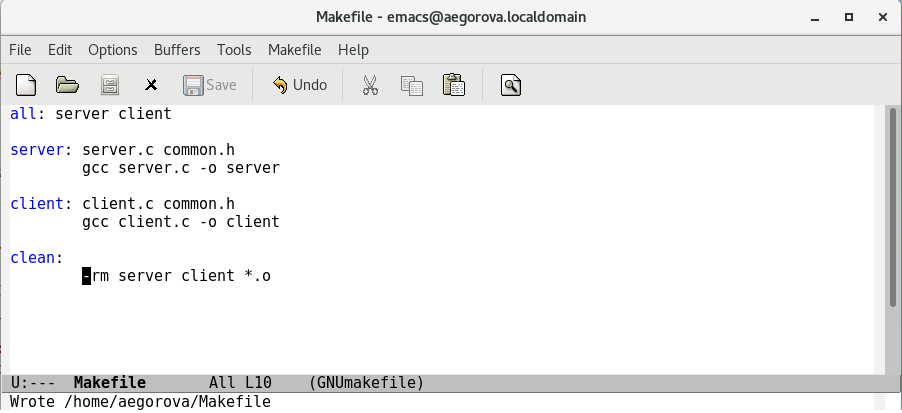
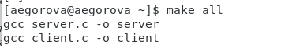
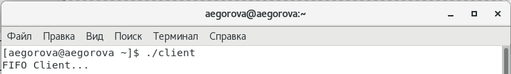
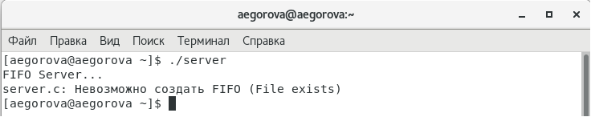

---
## Front matter
lang: ru-RU
title: Лабораторная работа №15
author: |
	Егорова Александра\inst{1}

institute: |
	\inst{1}RUDN University, Moscow, Russian Federation
date: 11 июня, 2021, Москва, Россия

## Formatting
toc: false
slide_level: 2
theme: metropolis
header-includes: 
 - \metroset{progressbar=frametitle,sectionpage=progressbar,numbering=fraction}
 - '\makeatletter'
 - '\beamer@ignorenonframefalse'
 - '\makeatother'
aspectratio: 43
section-titles: true
---

## Цель работы

Приобретение практических навыков работы с именованными каналами.

## Выполнение лабораторной работы

1) Для начала я создала необходимые файлы с помощью команды «touch common.h server.c client.c Makefile» и открыла редактор emacs для их редактирования (рис. -@fig:001)

{ #fig:001 width=70% }

## Выполнение лабораторной работы

2) Далее я изменила коды программ, представленных в тексте лабораторной работы. Common.h предназначен для заголовочных файлов, чтобы в остальных программах их не прописывать каждый раз. (рис. -@fig:002)

{ #fig:002 width=70% }

## Выполнение лабораторной работы

В файл server.c добавила цикл while для контроля за временем работы сервера. (рис. -@fig:003)

{ #fig:003 width=70% }

## Выполнение лабораторной работы

В файл client.c добавила цикл, который отвечает за количество сообщений о текущем времени. (рис. -@fig:005)

{ #fig:005 width=70% }

## Выполнение лабораторной работы

Makefile не изменяла. (рис. -@fig:007)

{ #fig:007 width=70% }

## Выполнение лабораторной работы

3) После написания кодов, используя команду «make all», скомпилировала необходимые файлы. (рис. -@fig:008)

{ #fig:008 width=70% }

## Выполнение лабораторной работы

Далее я проверила работу написанного кода. (рис. -@fig:010) (рис. -@fig:012)

{ #fig:010 width=70% }

{ #fig:012 width=70% }

## Выводы

В ходе выполнения данной лабораторной работы я приобрела практические навыки работы с именованными каналами.

